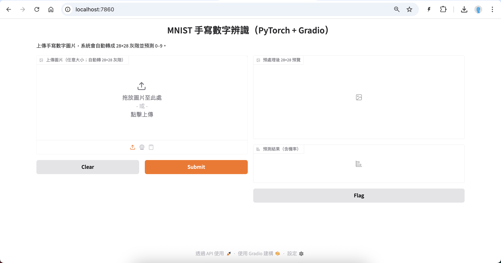
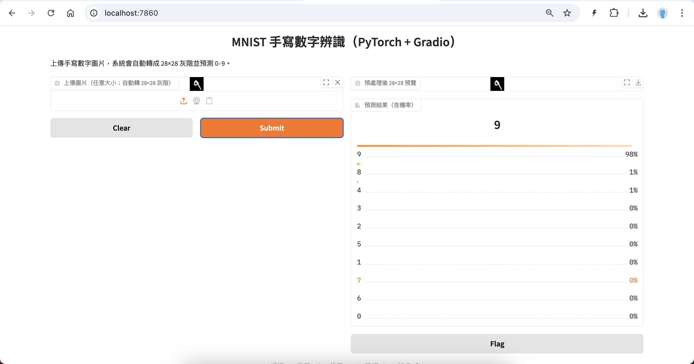

# MNIST-Min: 最小可用的手寫數字辨識專案（PyTorch）

這是一個**入門且有趣**的手寫數字辨識模型（0–9），
使用 **PyTorch + torchvision** 自動下載 MNIST 資料集，
提供完整流程：**下載資料 → 訓練 → 評估 → 推論**。

## 特色
- 小而完整：單檔 `train.py` 就能完成訓練與測試。
- 模型簡單：一個小型 CNN，1–3 個 epoch 即可收斂到 98%+。
- 推論友善：`infer.py` 可對單張 PNG 進行預測，會輸出每個類別機率。

## 環境需求
- Python 3.9+(basic), 3.10+(for gradio app.py running)
- 安裝依賴：
  ```bash
  conda create -n MNIST-Min-3.10 python=3.10 -y
  conda activate MNIST-Min-3.10

  tar -zxpvf mnist_min-250911.tgz
  cd mnist_min
  git checkout .
  pip install -r requirements.txt
  ```

> 若你在 macOS / Linux，且沒有 GPU，也可以用 CPU 版本的 PyTorch。

## 快速開始

### 1) 訓練與評估
```bash
python train.py --epochs 2 --batch-size 128
```
- 第一次會自動下載 MNIST（約 11MB）。
- 訓練結束會輸出：`model.pth` 與 `class_names.json`。

### 2) 產生範例圖片（可選）
```bash
python make_samples.py --count 10
```
- 會在 `samples/` 內存 10 張 `png` 和 `labels.csv`。

### 3) 單張圖片推論
```bash
python infer.py samples/0.png
```
- 會印出預測數字與機率分佈。

## 專案結構
```
mnist_min/
├─ train.py            # 訓練 + 測試 + 儲存模型
├─ infer.py            # 對單張 PNG 進行推論
├─ make_samples.py     # 從測試集匯出少量 PNG 樣本
├─ requirements.txt
├─ class_names.json    # 類別列表（訓練後生成）
├─ model.pth           # 已訓練模型（訓練後生成）
├─ samples/            # 範例 PNG 與 labels.csv（由 make_samples.py 生成）
|
├─ plot_history.py     # 產生訓練曲線圖
├─ model_card.md       # 模型卡：模型用途、資料、訓練方式、限制、倫理考量、匯出與部署方式
├─ export_onnx.py      # ONNX 匯出
├─ export_tflite.py    # TFLite 匯出
├─ onnxruntime_infer.py # ONNX Runtime 對單張 PNG 進行推論
├─ mnist_min.ipynb     # Jupyter Notebook（一鍵流程）：訓練→測試→匯出 ONNX→產生樣本→單張推論→顯示曲線
└─ app.py              # 開啟瀏覽器介面（Gradio）
```

## 小提示
- 想更快訓練：把 `--epochs` 改成 3 或 5。
- 想看更漂亮的曲線圖：可以自行加上 `matplotlib` 記錄 loss/accuracy。
- 想導出 ONNX：我可以幫你加一個 `export_onnx.py`。

---

祝你玩得開心！🎉 需要我做成 Jupyter Notebook 版或加上決策可視化，跟我說一聲就好。

---

## 進階功能
- **訓練曲線**：`python train.py --epochs 3 --save-plots` 或 `python plot_history.py`
- **ONNX 匯出**：`python export_onnx.py --model model.pth --out model.onnx`
- **Notebook**：開啟 `mnist_min.ipynb`，一鍵跑完整流程。

### 1) 訓練曲線圖
```bash
pip install matplotlib

# train.py 會輸出 history.json，可加 --save-plots 直接產生 loss.png 與 acc.png
python train.py --epochs 3 --save-plots

# 或用 plot_history.py 讀取 history.json 繪圖：
python plot_history.py --history history.json --out-dir .
```

### 2) ONNX 匯出
```bash
pip install onnx
python export_onnx.py --model model.pth --out model.onnx --opset 13
```

### 3) ONNX Runtime 推論
```bash
pip install onnxruntime
python onnxruntime_infer.py --onnx model.onnx --image samples/0.png
```

### 4) TFLite 匯出
```bash
pip install onnx onnx2tf tensorflow
pip install tf_keras onnx_graphsurgeon psutil sng4onnx ai_edge_litert
python export_tflite.py --onnx model.onnx --out model.tflite --quant int8
```

### 5) 開啟瀏覽器介面（Gradio）
```bash
pip install gradio
python app.py
```
#### app.py 執行畫面

#### app.py 模型預測結果

